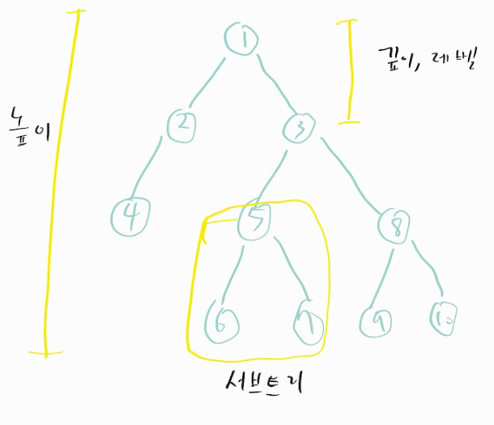
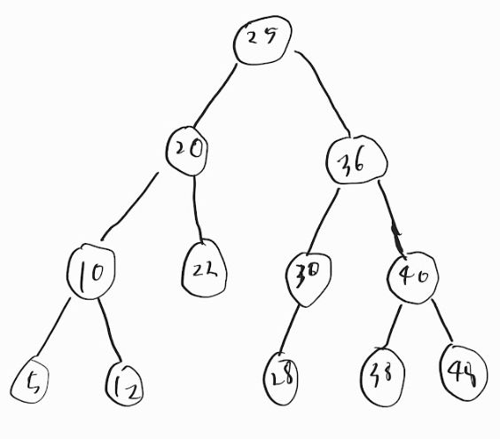

## 그래프

: 정점과 간선으로 이루어진 자료구조

**용어** 

정점: 무언가를 통해 간다 했을때 어떠한곳

간선: 정점 사이의 거리

단방향 간선 : 예시 짝사랑 관계

가중치 : 간선과 정점 사이에 드는 비용

## 트리

: 정점과 간선으로 이루어져 있고 트리구조로 계층적 데이터 집합

**용어** 

루트 노드 : 가장위에 노드

내부노드 : 루트노드와 내부노드 사이에 노드

리프노드 : 자식 노드가 없는 노드

### 트리의 높이와 레벨

깊이 : 루트 노드부터 특정노드 까지 최단거리로 갔을때의 거리

ex) 4번 노드 깊이는 2

높이 : 루트 노드부터 리프노드 까지중 가장 긴 거리

ex) 트리 높이는 3

레벨 : 깊이와 같은 의미 (기준에 따라 다름)

ex) 1번노드 0레벨라고 하면  2번,3번노드 1레벨

​      1번노드 1레벨라고 하면 2번,3번노드 2레벨 

서브트리: 트리내의 하위 집합 (트리내에 있는 부분 집합)

### 이진트리

완전 이진트리:왼쪽부터 채워져 있는 이진트리

변질 이진트리: 자식노드가 하나 밖에 없는 이진트리

포화 이진트리: 모든 노드가 꽉차있는 이진트리

균형 이진트리: 왼쪽과 오른쪽 노드의 높이차이가 1이하인 이진트리

### 이진 탐색 트리 (BST)

: 노드의 오른쪽 하위트리 -> 노드값보다 큰 값, 왼쪽 하위트리 -> 노드 값보다 작은 값

이렇게 해두면 검색하기 용이하다