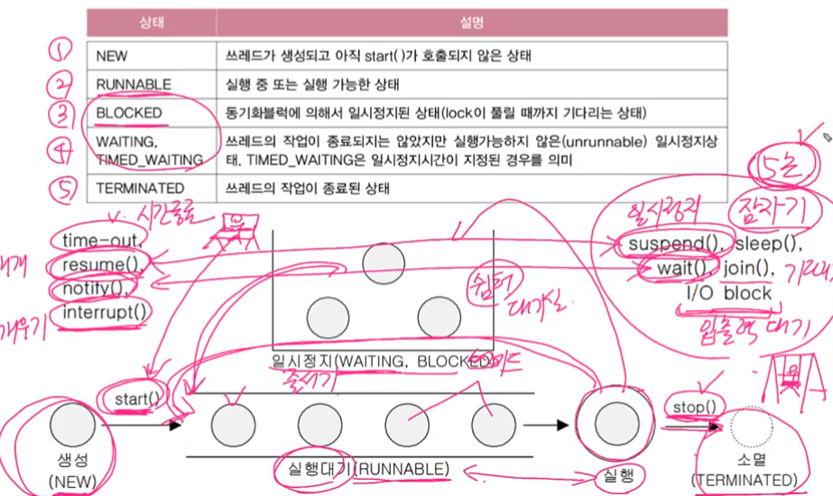

# 쓰레드

[TOC]

### 프로세스, 쓰레드

프로세스 : 실행중인 프로그램, 자원과 쓰레드로 구성

쓰레드 : 실제 작업을 수행, 하나의 스레드를 가짐

> 프로세스 : 쓰레드 = 공장 :일꾼

###  멀티쓰레드 장단점

| 장점                            | 단점                                                |
| :------------------------------ | --------------------------------------------------- |
| - 시스템 자원을 효율적으로 사용 | - 동기화 주의가 필요함                              |
| - 사용자 응답성이 향상          | - 교착상태가 발생하지 않도록 주의                   |
| - 작업이 분리되어 코드가 간결   | - 쓰레드가 효율적으로 고르게 실행될수 있게 해야한다 |

### 쓰레드 구현과 실행

1. Thread를 상속

~~~java
class MyThread extends Thread{
	public void run() { // Thread클래스의 run()을 오버라이딩
	
	}
}
~~~

2. Runnable인터페이스를 상속 (좀더 추천 - 여러개 상속을 받을수 있기 때문에)

~~~java
class MyThread2 implements Runnable {
	public void run() { //Runnable 인터페이스의 추상메서드 run()을 구현
	
	}
}
~~~

### 쓰레드 실행 - start()

~~~java
ThreadEx1 t1 = new ThreadEx1();
ThreadEx1 t2 = new ThreadEx1();

t1.start();
t2.start();
~~~

- 먼저 실행했다고 먼저 시작하진 않는다
- 시작은 os 스케줄러가 실행순서 결정 
- 새로운 스택을 생성하고, 그 생성된 스택에서 run메소드를 실행한다.

### 메인쓰레드

- 실행중인 사용자 스레드가 하나도 없을때 프로그램이 종료된다

   

### I/O 블락킹

- 쓰레드가 입출력처리를 위해 기다리는 것

### 쓰레드 우선순위

~~~java
void setPriority(int newPriority); // 쓰레드는 우선순위를 지정한값으로 변경
int getPriority() // 쓰레드의 우선순위를 반환
~~~

우선순위 범위 1~10까지

### 쓰레드 그룹

- 서로 관련된 쓰레드를 그룹을  묶어놓은것

- 모든 쓰레드는 반드시 하나의 쓰레드 그룹에 포함됨
- 쓰레드 그룹을 지정하지 않고 생성한 쓰레드는 'main쓰레드 그룹'에 속한다

### 데몬 쓰레드

- 일반 쓰레드의 작업 보조
- 일반 쓰레드가 모두 종료되면 자동적으로 종료

### 쓰레드 상태

### 쓰레드 실행제어

sleep() - 지정된 시간동안 쓰레드를 멈추도록 한다

interrupt() - 일시정지 쓰레드를 깨워서 실행대기상태로 만듬

>  suspend() - 쓰레드를 멈춤
>
> resume() - suspend()로 멈춘것을 다시 실행대기 상태로 되게한다

stop() - 호출되는 즉시 쓰레드 종료

join() -다른 쓰레드 작업을 기다림

yield() - 다른 쓰레드에게 양보

### 쓰레드 동기화

한쓰레드가 특정작업을 끝마치기 전까지 다른 쓰레드에 의해 방해받지 않도록 하는것이 필요하다 

그래서 임계영역 잠금이라는 것이 등장 

- 한쓰레드가 진행중인 작업을 다른 쓰레드가 간섭하지 못하게 하는것

#### synchronized 동기화

~~~java
//1. 메서드 전체를 임계영역으로 지정 
public synchronzied void calcsum() {
    //                            임계영역
}

//2. 특정한 영역을 임계영역으로 지정 
// 메서드전체를 하는것볻가 부분적으로 하는것이 좋다 
synchronized(객체의 참조변수){
    //  ..                     임계영역
}

~~~

#### wait()과 notify

동기화의 효율 개선 목적으로 사용

wait( ) - 객체의 락을 풀고 스레드를 해당 객체의 waiting pool에 넣음. 

 notify( ) - 무작위로 waiting pool에 있는 스레드 하나를 깨움.  

 notifyAll( ) - 다 깨움. 스레드 하나만 락을 얻음.

 wait(), notify() 호출의 대상이 불분명함.  ->   단점을 해소한 것이 lock&condition.