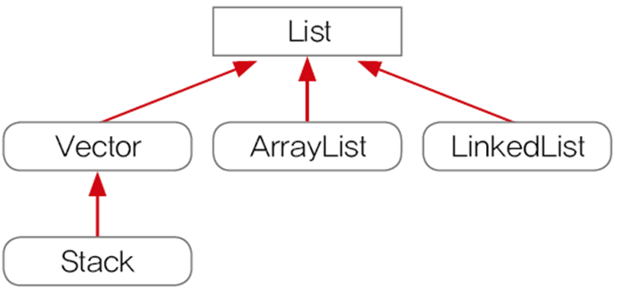
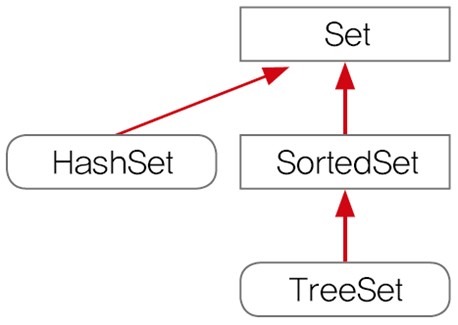
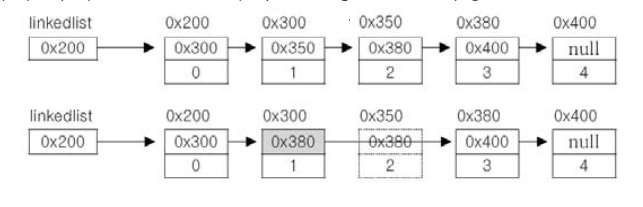
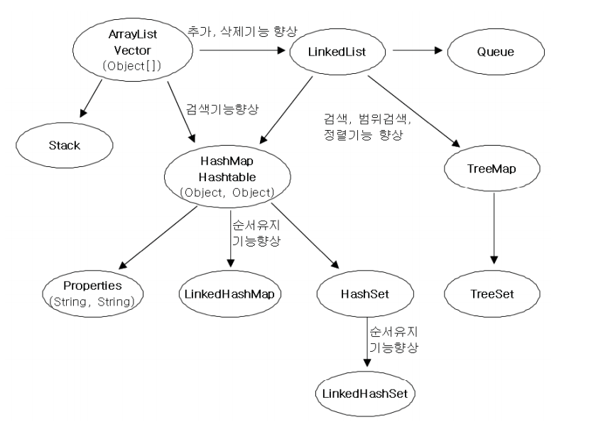

# 컬렉션 프레임웍

## 컬렉션 프레임웍이란? 

컬렉션(collection)

- 여러 객체를 모아 놓은 것

프레임웍

- 정형화된 체계적인 프로그래밍 방식

컬렉션 프레임웍

- 컬렉션을 다루기 위한 표준화된 프로그래밍 방식

- 컬렉션을 쉽고 편리하게 다룰 수있는 다양한 클래스를 제공

컬렉션 클래스 

- 다수의 데이터를 저장할수 있는 클래스

---

### 컬렉션 프레임웍의 핵심 인터페이스

| 인터페이스 | 특징                                                         |
| :--------- | :----------------------------------------------------------- |
| List       | 순서있는 데이터의 집합. 데이터의 중복을 허용                 |
|            | 구현클래스 : ArrayList, Stack                                |
| Set        | 순서를 유지하지 않는 집합 . 데이터의 중복을 허용x            |
|            | 구현클래스 : HashSet, TreeSet                                |
| Map        | 키와 값의 쌍으로 이루어진 데이터 집합, 순서는 유지 x, 키 중복 x, 값 중복 o |
|            | 구현클래스 : HashMap, TreeMap, Hashtable 등                  |

### LIST인터페이스의 메서드 

- 순서 O , 중복 O

- 추가 , 검색, 삭제 , 정렬

### SET 인터페이스

- Set인터페이스 - 순서 X, 중복  X

### Map인터페이스

-  순서 X , 중복(키X, 값 O)

---

### ArrayList

- List인터페이스를 구현하므로 , 저장순서가 유지되고 중복을 허용
- 배열에서 추가,삭제 기능이 추가됨
- 데이터의 저장공간으로 배열을 사용

- 삽입 과 삭제 과정 
  - 삽입시 데이터를 한칸씩 위로 복사해서 삭제할 데이터를 덮음
  - 삭제시 한칸씩 아래로 복사한다

### LinkedList

- 배열의 단점 : 크기 변경 x, 추가,삭제시 시간이 많이 걸림

- 각 요소들 별로 다음요소의 주소값과 데이터를 구성하고 있다

추가및 삭제가 편리해 졌다

- 단 다음요소 만을 저장이 가능해서 접근이 나쁘다 

- 그래서 더블리 링크드 리스트(이중연결리스트), 더블리 써큘러 리스트(이중원형 연결리스트 )가 나왔다

### ArrayList 와 LinkedList 차이

|   컬렉션   |  읽기  | 추가/삭제 |               비고                |
| :--------: | :----: | :-------: | :-------------------------------: |
| ArrayList  | 빠르다 |  느리다   |   순차적인 추가삭제는 더 빠르다   |
| LinkedList | 느리다 |  빠르다   | 데이터가 많을수록 접근성이 떨어짐 |

---

### Stack과 Queue

|      |                      정의                      |   추천    |         활용 예          |
| :--: | :--------------------------------------------: | :-------: | :----------------------: |
| 스택 | LIFO - 마지막에 저장한 데이터를 가장 먼저 꺼냄 | ArrayList | 수식계산,웹브라우저 앞뒤 |
|  큐  |  FIFO - 처음에 저장한 데이터를 가장 먼저 꺼냄  | LinkList  |    최근사용문서, 버퍼    |

---

### Iterator

컬렉션에 저장된 요소를 접근하는데 사용되는 인터페이스

~~~java
List list  = new ArrayList();
Iterator it = list.iterator();

while(it.hasNext()){ //boolean hasNext() 읽어올 요소가 있는지 확인
	System.out.println(it.next()); // Object next() 다음요소를 읽어옴
}
~~~

---

### Map

- 키와 값으로 쌍으로 저장
-  Map은 Iterator가 없다 : keySet(), entrySet(), values() 사용

~~~java
Map map = new HashMap();
Iterator it = map.entrySet().iterator();
~~~

---

### Arrays 의 메서드

- 모두 static 메서드 이다 

#### 배열 복사 - copyOf(), copyOfRange()

copyOf()  - 배열 전체

copyOfRange() - 배열 일부 복사 새로운 배열 만듬

~~~java
int[] arr = {0,1,2,3,4,5};
int[] arr2 = Arrays.CopyOf(arr,3);
int[] arr5 = Arrays.CopyOfRange(arr,0,7);

~~~

#### 배열 채우기 - fill(), setAll()

fill() - 배열의 모든 요소를 지정된 값으로 저장 

setAll() - 배열을 채우는데 사용할 함수형 인터페이스로 매개변수로 받는다 

~~~java
int[] arr = new int[5];
Arrays.fill(arr,9);
Arrays.setAll(arr,(i) -> (int)(Math.random()*5)+1);
~~~

#### 배열의 정렬과 검색 - sort(), binarySearch()

sort() - 배열을 정렬

binarySearch() - 배열에 저장된 요소를 검색

~~~java
int[] arr = {3,2,0,1,4};
int idx = Arrays.binarySearch(arr,2);

Arrays.sort(arr);
int idx = Arrays.binarySearch(arr,2);
~~~

#### 문자열의 비교와 출력 - equal(), toString()

toString() - 배열의 모든 요소를 문자열로 

deepToString() - 다차원 배열 

equals() - 두배열 비교  같으면 true 다르면 false

#### 배열을 List 변환 - asList

asList() - 배열을 List에 담아 반환

~~~
List list = Arrays.asList(1,2,3,4,5);
~~~

---

### Comparator와 Comparable

comparable - 기본 정렬기준으로 구현 , compareTo 메소드 사용

comparator - 특정한 정렬기준이 필요할때 ,  compare() 메소드 사용

---

### HashSet

- 순서 x, 중복 x

- set인터페이스를 구현한 대표적인 컬렉션 클래스

~~~
 add, addAll(합집합), remove, removeAll(교집합), retainAll(차집합), clear(모두삭제), containAll(여러객체 모두 포함)
~~~

---

### TreeSet

- 이진탐색트리로 구현, 범위탐색과 정렬에 유리
- 데이터가 많아질수록 추가, 삭제에 시간이 더 걸림

---

### HashMap

- 키와 값을 쌍으로 저장
- 순서 x, 중복(키x, 값 o), 해싱

- 순서를 유지하려명 LinkedHashMap 사용
- TreeMap
  - 범위 검색과 정렬에 유리한 컬렉션
  - hashMap보다 데이터추가,삭제에 시간이 더 걸림

- 해싱의 원리 : 환자정보관리 예제 생각, 해시 함수를 이용해서 해시테이블에 있는 데이터 읽고 저장 
-  해시테이블 : 배열과 링크드리스트가 조합된 형태(chaining), 접근성과 변경의 유리를 섞은 형태 
-  저장된 데이터를 가져오는 과정 : 키로 해시함수 호출하고 해시코드를 얻는다 -> 해시코드(해시f반환값)에 대응하는 LL를 배열에서 찾는다 -> LL에서 키와 일치하는 데이터 탐색

- 키 가져오기 keySet() set타입의 데이터를 가져옴
- 값 가져오기 values() collection타입의 데이터를 얻을수있다

---

### Collection

콜렉션 가져오기 

- for루프랑 iterator() 메서드를 가져온다

- 컬렉션 동기화 synchronizedXXX()
- 변경불가 컬렉션 - unmodifiableXXX()

- 싱글톤 컬렉션 - singletonXXX() 
- 한 종류의 객체만 저장하는 컬렉션 - checkedXXX()

---

### 콜렉션 클래스 정리

