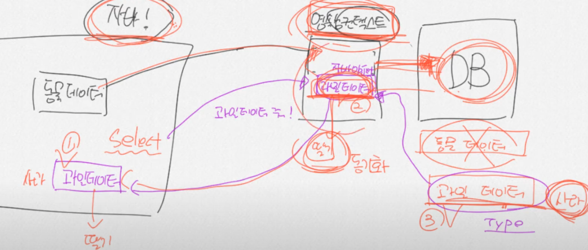
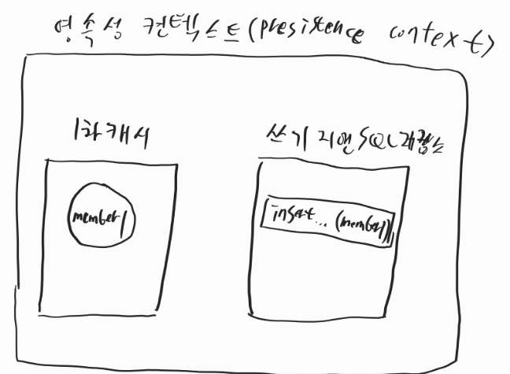
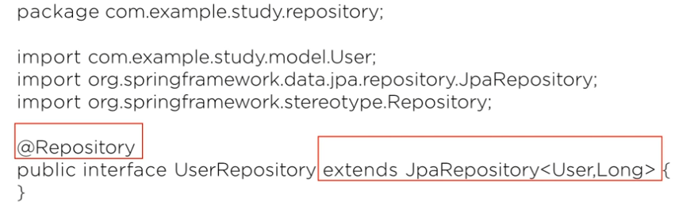

## 

**영속성** : 데이터 -> 영구적으로 저장

**컨텍스트** : context 대상의 모든 정보

- 영속성 컨텍스트는 자바와 db사이에서 데이터를 전달해주는 역할을 해준다
- 데이터를 넘겨주면 동기화 작업을 한다

## jpa 어노테이션

~~~java
import lombok.Getter;

import javax.persistence.*;

@Getter
@Setter
@NoArgsConstructor
@Entity  // (1)
public class Member {
    @Id  // (2)
    @GeneratedValue  // (3)
    private Long memberId;

    private String email;

    public Member(String email) {
        this.email = email;
    }
}
~~~

@Entity : 테이블과 링크돨 클래스임을 나타냄

@id : pk 필드를 나타냄

@GeneratedValue : pk생성 규칙을 나타냄

~~~java
    private void example() {
     
        tx.begin();
        Member member = new Member("hgd@gmail.com");

        em.persist(member);

  
        tx.commit();

        Member resultMember1 = em.find(Member.class, 1L);

        System.out.println("Id: " + resultMember1.getMemberId() + ", email: " + resultMember1.getEmail());

  
        Member resultMember2 = em.find(Member.class, 2L);

 
        System.out.println(resultMember2 == null);

    }
~~~

- `em.persist()`를 호출하면 영속성 컨텍스트의 1차 캐시에 엔티티 클래스의 객체가 저장되고, 쓰기 지연 SQL 저장소에 INSERT 쿼리가 등록된다.
- `tx.commit()`을 하는 순간 쓰기 지연 SQL 저장소에 등록된 INSERT 쿼리가 실행되고, 실행된 INSERT 쿼리는 쓰기 지연 SQL 저장소에서 제거된다.
- `em.find()`를 호출하면 먼저 1차 캐시에서 해당 객체가 있는지 조회하고, 없으면 테이블에 SELECT 쿼리를 전송해서 조회한다

## 영속성 컨텍스트 관련 jpa api

- `em.persist()`를 사용해서 엔티티 객체를 영속성 컨텍스트에 저장할 수 있다.
- 엔티티 객체의 setter 메서드를 사용해서 영속성 컨텍스트에 저장된 엔티티 객체의 정보를 업데이트 할 수 있다.
- `em.remove()`를 사용해서 엔티티 객체를 영속성 컨텍스트에서 제거할 수 있다.
- `em.flush()`를 사용해서 영속성 컨텍스트의 변경 사항을 테이블에 반영할 수 있다.
- `tx.commit()`을 호출하면 내부적으로 `em.flush()`가 호출된다.

---

# JPA 사용법

## 1 .Entity 지정

DB TABLE = JPA Entity

JPA에서는 테이블을 자동으로 생성해주는 기능

|   Annotation    |                             용도                             |
| :-------------: | :----------------------------------------------------------: |
|     @Entity     |                 해당 class가 entity임을 명시                 |
|     @Table      | 실제 db테이블의 이름을 명시 . 클래스와 동일하면 안써주어도됨 |
|       @Id       |                   Index primary key를 명시                   |
|     @Column     |  실제 db column의 이름을명시, 이것도 동일하면 안써주어도됨   |
| @GeneratedValue |                primary key 식별키의 전략 설정                |

## 2. Repository 생성

따로 쿼리문을 작성하지 않아도 기본적인 CRUD 작업을 할수 있다

## 3. JPA CRUD

~~~java
//SAVE 
User newUser = userRepository.save(user);

//READ
Optional<User> user = userRepository.findById(2L);

~~~

