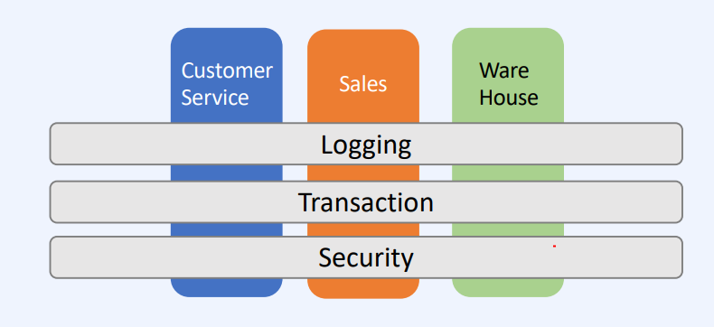
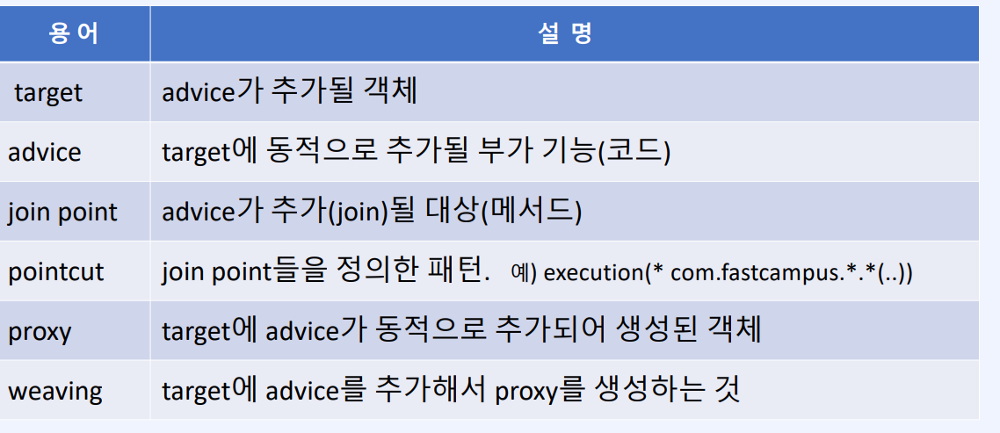
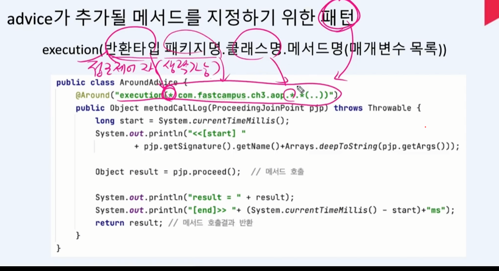

## AOP

부가기능을 동적으로 추가해주는 기술

공통적인 로직을 횡단관심사 라고 부른다. 

공통로직을 각 계층에서 개별적으로 구현하면 코드 유지관리가 어려워지므로 AOP통해서 관심사 분리를 하여서 관리를 해줍니다.

메서드의 시작과 끝에 자동으로 코드를 추가

### AOP 관련 용어

### Advice 종류

### poincut expression

