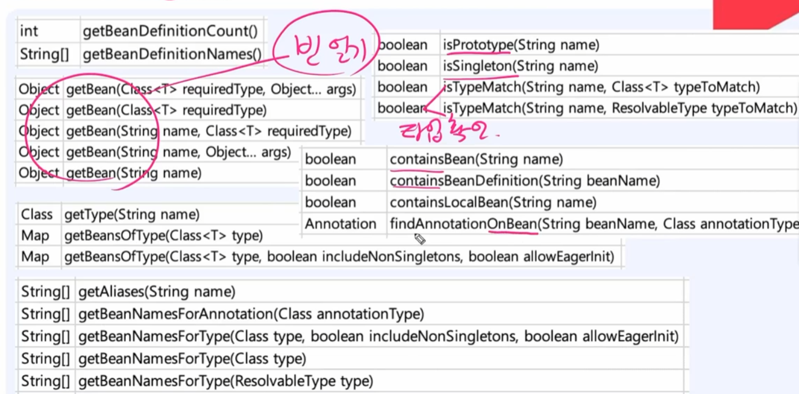
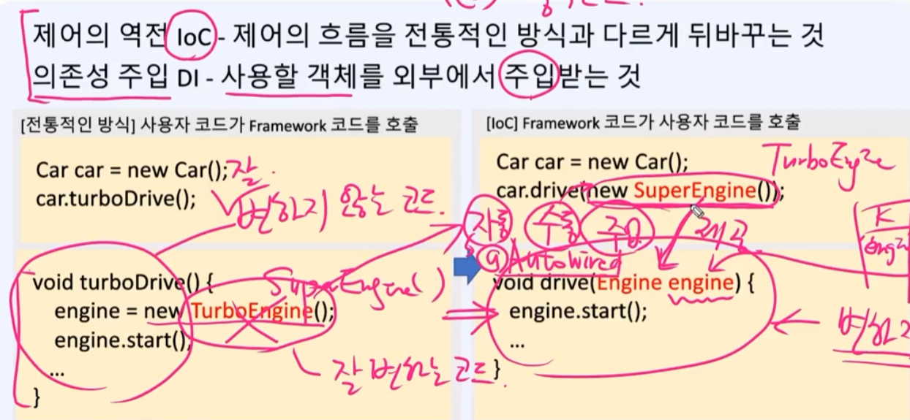
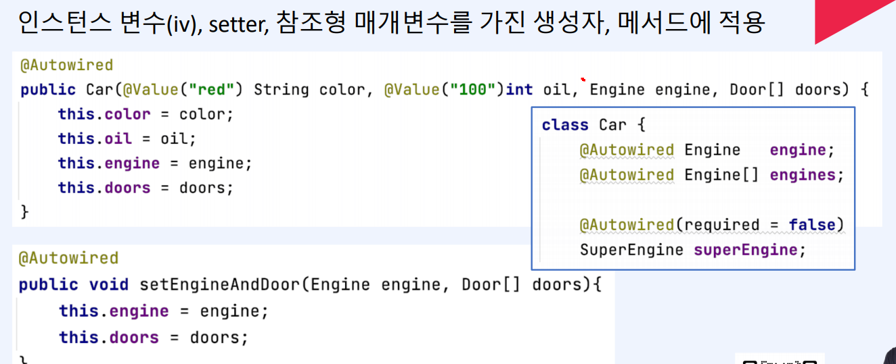
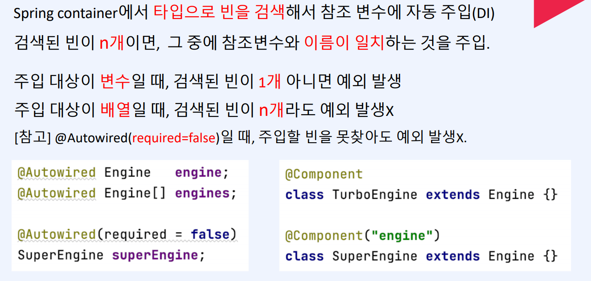
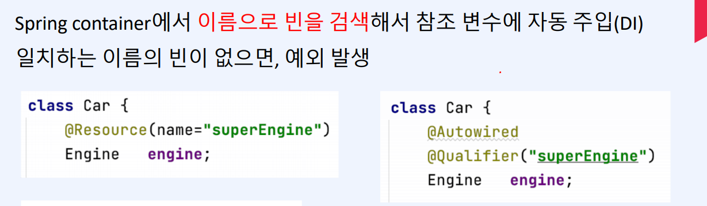
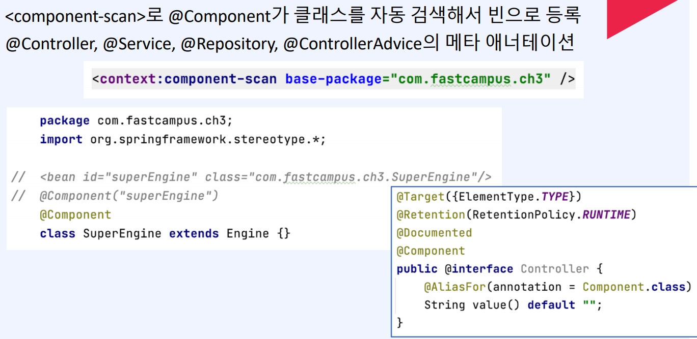
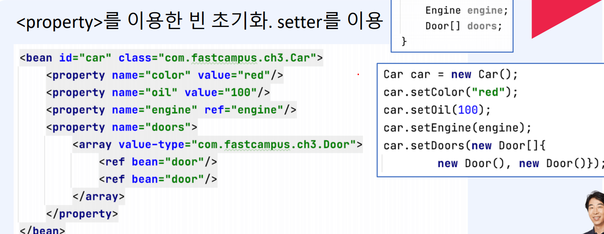
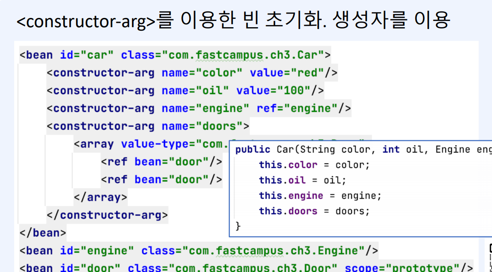
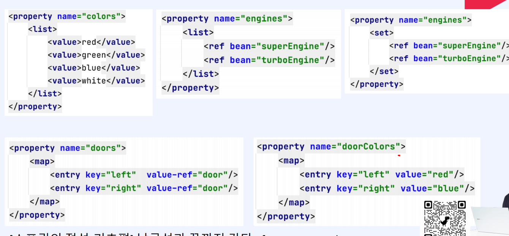

### Spring DI

---

1. 변경에 유리한 코드 - 다형성을 이용

2. map과 외부파일 

### 분리

1. 변하는것, 변하지 않는것 
2. 관심사
3. 중복코드 (AOP)

## 2. 객체컨테이너 만들기

ApplicationContext에 map형식으로 key와 value형식으로 값을 추가를 해준다

getBean("car"); 형식으로 값을 가져온다

### 자동객체등록 - Component scanning

- 패캐지내의 모든 클래스를 읽어서 어노테이션이 붙은 클래스를 객체를 생성해서  map에 저장한다

~~~java
@Component class Car{}
@Component class Engine{}
~~~

### 객체찾기 - by name, by type

~~~java
AppContext ac = new AppContext();
Car car = (Car) ac.getBean("car"); //이름으로 찾기
Car car2 = (Car) ac.getBean(Car.class); // 타입으로 찾기

//이름으로 찾기
Object getBean(String key) {
    return map.get(key);
} // byName

// 타입으로 찾기
Object getBean(Class clazz) { // byType
    for(Object obj : map.values()){
        if(clazz.isInstance(obj))
            return obj;
    }
    return null;
}
~~~

### 객체 자동연결

@Autowired - by type

@Resource - by name

---

## 이론

ApplicationContext의 메서드

### IOC와 DI

### @Autowired

생성자의 @Autowired 생략가능 

@Resource

@Component

@Compoent 어노테이션이 달려있는곳에 빈으로 등록 

다른 @Controller, @Serice등을 써주어도 안에 @Component가 포함이 되어있어서 똑같이 스캔이 되어 빈으로 등록이 된다

### 빈 초기화

