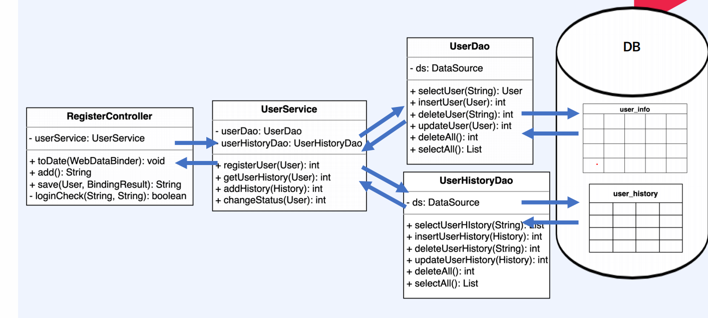
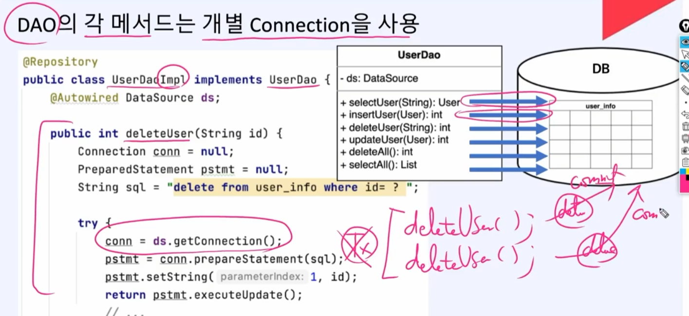
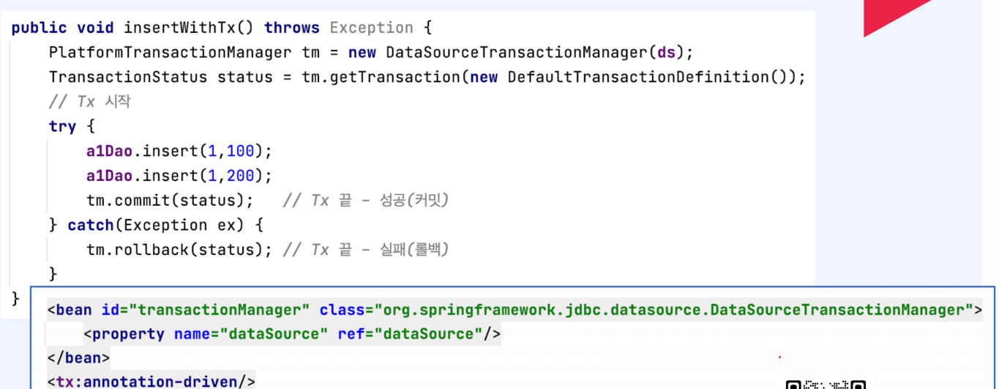
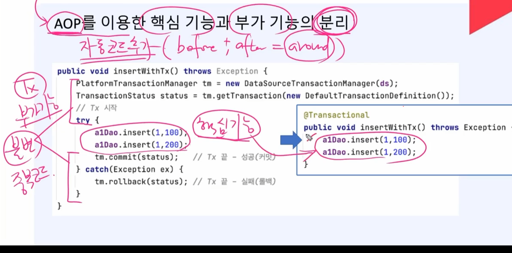
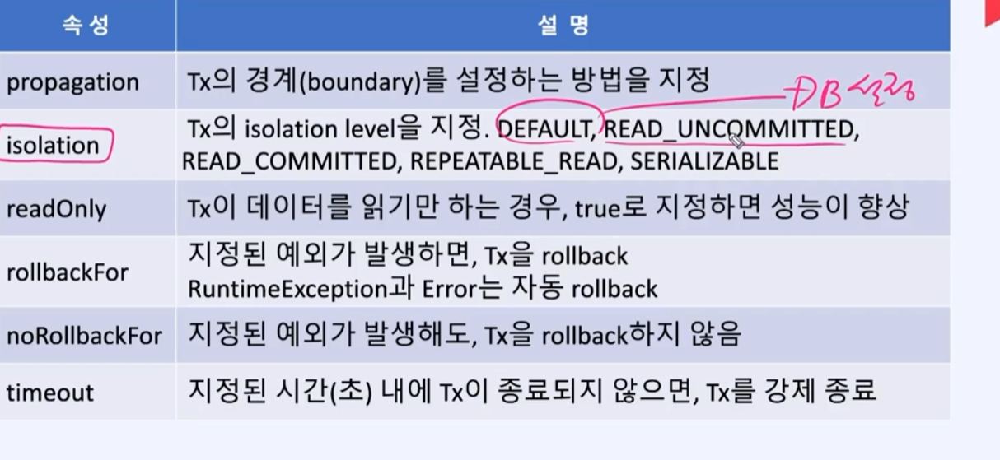
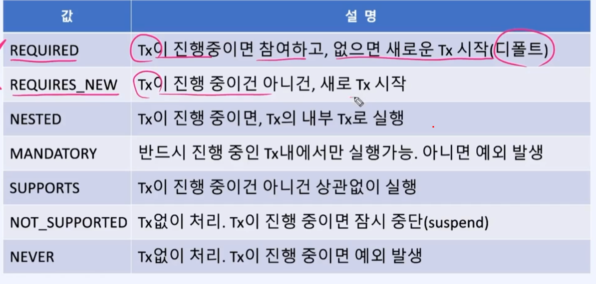
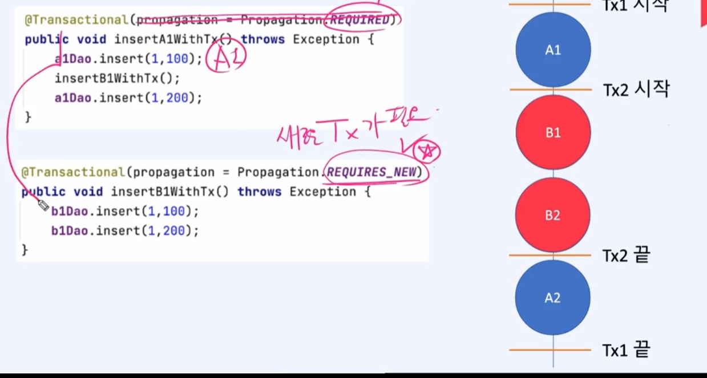

## 비즈니스 로직의 분리

### TransactionManger

- 트랜잭션은 1개의 connection에서 작동
- 그래서 2개의 메서드가 같이 실행되면 트랜잭션이 안되게 된다 그래서 그것을 보완해서 1개의 connection을 쓸수 있도록 TransactionManger를 사용한다

### TransactionManger로 transaction 적용하기

### @Transactional로 적용하기

부기기능을 줄여서 위에 어노테이션으로 대처 

@Transactional는 클래스나 인터페이스에도 붙일수 있음

### Tranational 속성

### propagartion 속성의 값

### REQUIRED과 REQUIRES_NEW차이

REQUIRED는 TX2에서 실패시  맨처음 TX1시작으로 ROLLBACK

REQUIRES_NEW는 TX2에서 실패시 TX2시작으로 ROLLBACK