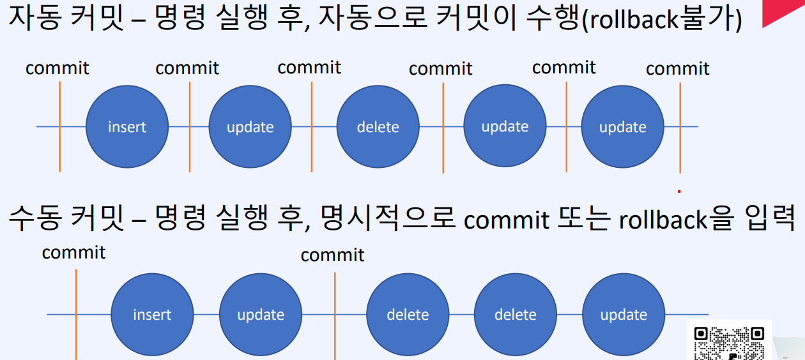
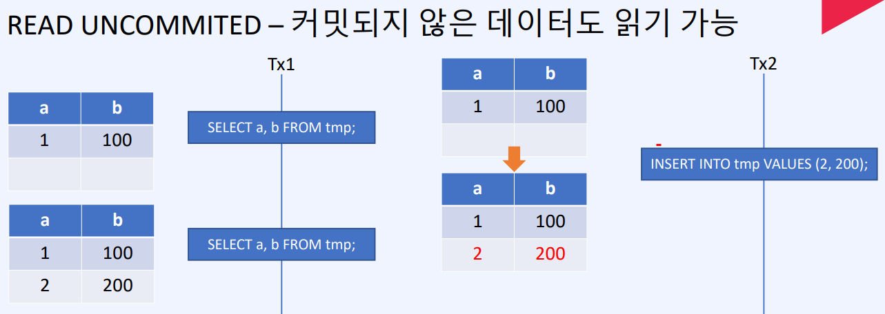
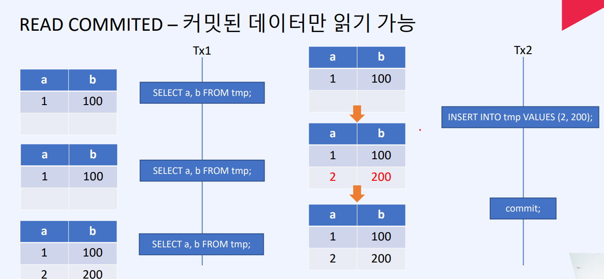
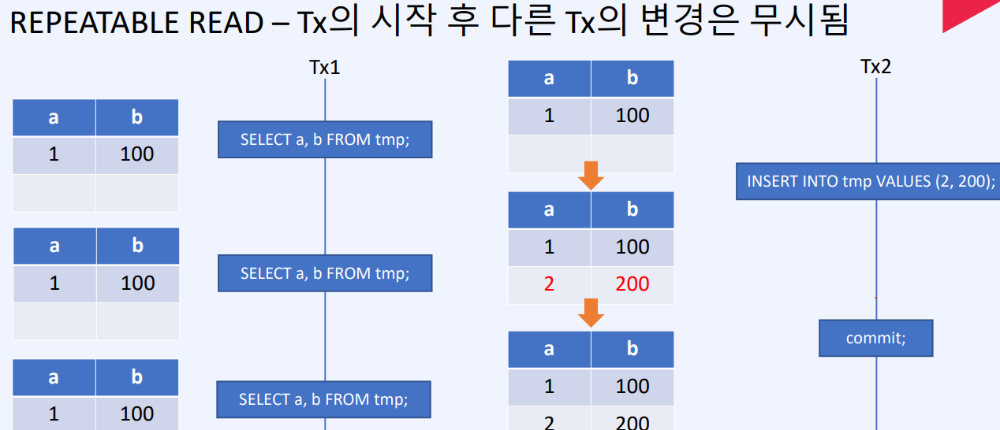
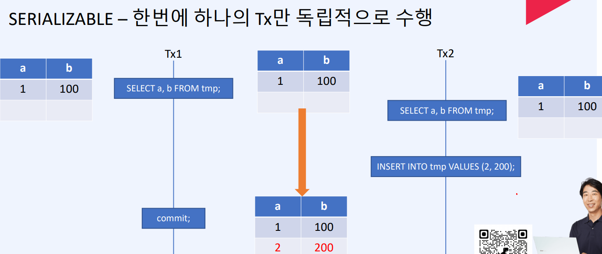

## Tranaction

더이상 나눌수 없는 작업의 단위

계좌이체의 경우 , 출금과 입금이 하나의 tx로 묶여야됨

모아니면 도 출금과 입금이 모두 성공하지 않으면 실패

### trasaction 속성 - ACID

- 원자성 - 나눌수 없는 하나의 작업으로 다뤄져야  한다
- 일관성 - TX 수행전과 후가 일관된 상태를 유지해야 한다
- 고립성 - 각 TX는 독립적으로 수행되어야 한다
- 영속성 - 성공한 TX의 결관느 유지되어야 한다

### 커밋과 롤백

- 커밋 : 작업 내용을 DB에 영구적으로 저장
- 롤백 - 최근 변경사항을 취소 (마지막 커밋으로 복귀)

### 자동 커밋과 수동 커밋

### TX의 isolation level

- READ UNCOMMITED - 커밋되지 않은 데이터도 읽기 가능 
- READ COMMITED - 커밋된 데이터만 읽기 가능
- REPEATABLE READ - Tx이 시작된 이후 변경은 무시됨 - default
- SERIALIZABLE - 한번에 하나의 TX만 독립적으로 수행

READ UNCOMMITED

READ COMMITED

REPEATABLE READ

SERIALIZABLE

