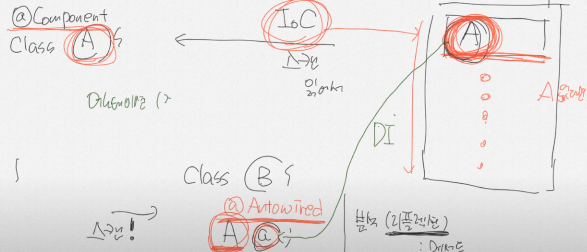

@Compoent , @Autowired

@Component

: 스캔해서 컨포넌트 어노테이션을 붙은 것을 힙메모리에 올린다 

@Autowired

: 스캔해서 오토와이어드가 붙으면 힙메모리에서 동일한것을 찾아 없으면 null리턴 잇으면 힙메모리에 주소값  리턴

톰캣 

- 웹서버에서는 자바파일을 읽지 못하므로 

- 자바코드를 해석해서 html파일로 변환해서 준다