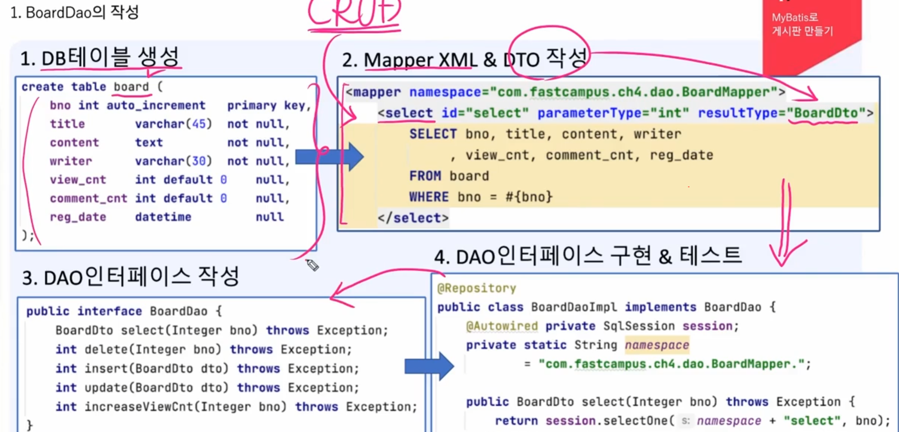
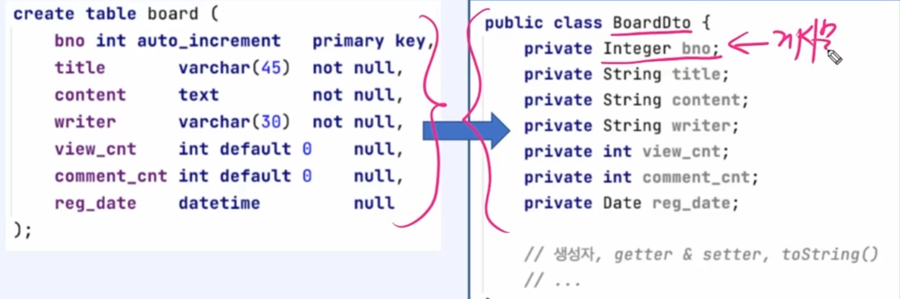
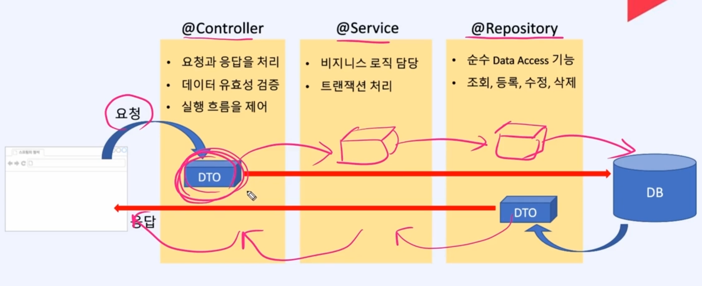
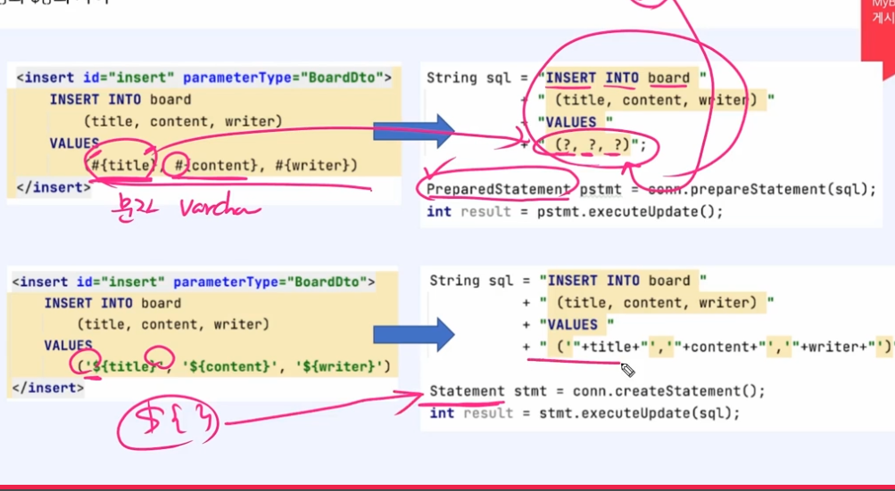
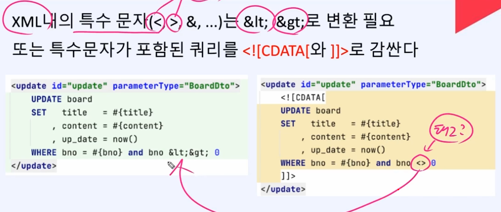

# boardDao 작성

---

### DTO

- 계층간의 데이터를 주고 받기 위해 사용되는 객체

ID 값을 Integer로 해서 null값이 들어오게 되어도 에러가 나지 않도록한다

---

## model이 필요한이유

- 관심사 분리를 하면서 각 필요한 값을 전달하기위해서 모델에 값을 저장해서 전송해준다

---

## vo

- 잘못된 용어이다

- 값 객체 

- 변경불가

### #{} 와 ${} 차이

#{} 

- 값만 변경 가능 
- 이것을 대부분 쓸것
- sql injection을 막아줌

${}

- 테이블도 변경가능 
- 내부에서만 쓸것

### xml 특수문자 처리

---

