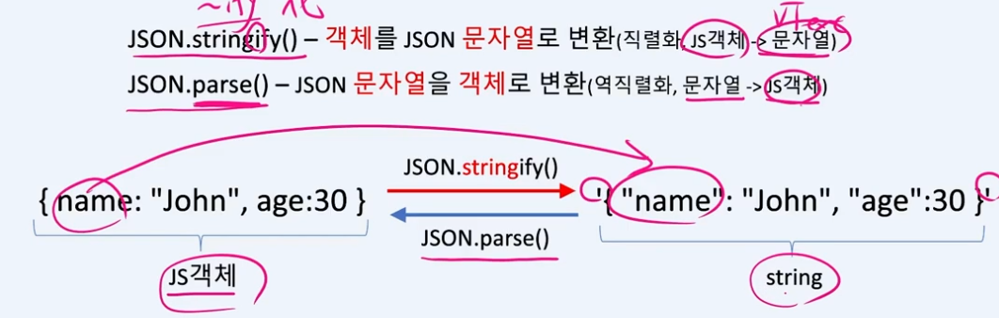
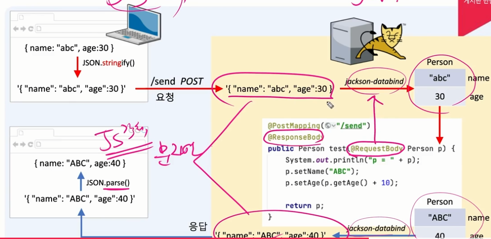

# json

자바스크립트 객체 표기법

## stringify() 와 parse()

js객체를 서버로 전송하려면 직렬화가 필요

서버가 보낸 데이터(문자열)을 js객체로 변환할때 , 역직렬화가 필요

## ajax

비동기통신으로 데이터를 주고 받기 위한 기술

웹페이지 전체가 아닌 일부만 업데이트 가능

## ajax요청과 응답과정

js객체를 보낼때 변환하여 text형태(json)으로 보내면(json.stringify()) 서버에서 jackson을 이용해서 자바객체로 변환해서 처리하고 

다시 json으로 변환하여 응답하여서 브라우저에서 js객체로 변환(JSON.parse())해서 받는다 

### @ResponseBody 어노테이션

- 요청의 바디 부분의 정보를 받아온다

~~~java
@PostMapping("/send")
@ResponseBody public Person test(@RequestBody Person p){
	...
	return p;
}
~~~

## @RestController

@ResponseBody대신 클래스에 @RestController 사용가능

앞에 @ResponseBody 붙여줄 필요없이 컨트롤러에 @RestController 사용하면 된다

