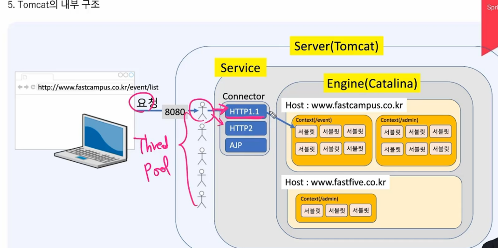
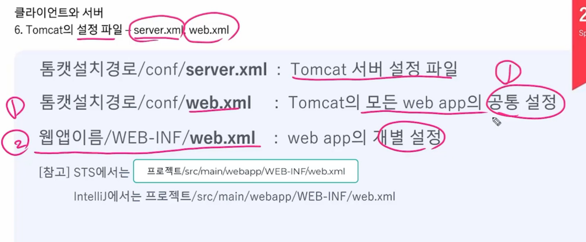
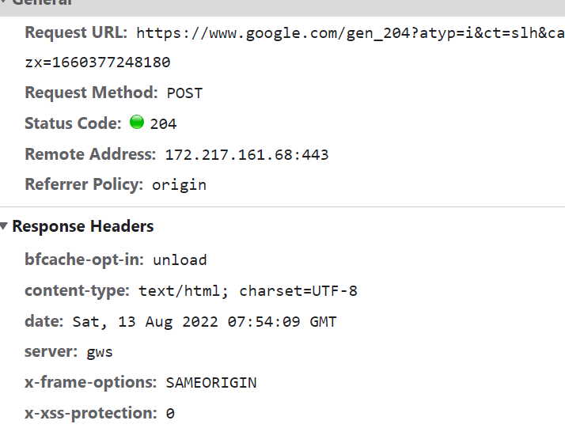
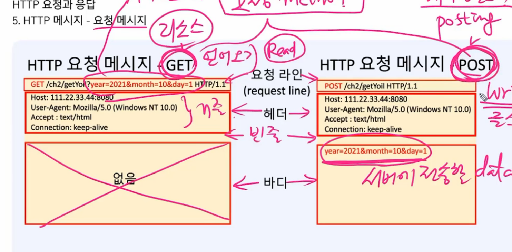

## 클라이언트, 서버

---

#### HttpServletRequest 메서드

~~~java
String year = request.getParameter("year");
String month = request.getParameter("month");
String day = request.getParameter("day");

Enumeration enum = request.getParmeterNames();
Map paramMap = request.getParmeterMap();
String[] yearArr = request.getParmeterValues("year");
~~~

---

### 포트

서버에 여러개의 서버가 존재할수 있으므로 ip주소만으로는 구별이 불가하여 뒤에 포트번호를 써주어야 한다 

- 웹서버는 기본이 80이라 생략가능

---

### was

웹 애플리케이션 서버

클라이언트가 프로그램을 사용할수 있도록해주는것 

ex) tomcat

장점: 프로그램을 서버에 설치해서 업데이트에 용이

서버에서 클라이언트한테 실행결과만 전송한다

---

### 서블릿

작은 서버 프로그램

컨트롤러와 같은 개념이다 

thredpool을 미리 만들어 둔다

---

톰캣 설정파일

원격 프로그램 

1. 서블릿 등록 -> @ Controller

2. url 연결 -> @RequestMapping

3. web.xml -> 애너테이션

---

###  프로토콜

서로간의 통신을 위한 약속, 규칙

주고받을 데이터에 대한 형식을 정의한것

---

### HTTP

상태 예시

1. 단순하고 읽기 쉽다 

2. 상태를 유지하지 않는다(staeless) - 클라이언트 정보를 저장하지 않음

3. 확장이 가능하다. 커스텀 헤더 추가 가능

---

#### http 응답메세지

| 상태코드 |      의미       |
| :------: | :-------------: |
|   100    |      정보       |
|   200    |      성공       |
|   300    |     재요청      |
|   400    | 클라이언트 오류 |
|   500    |    서버 오류    |

---

요청메세지 GET,POST   차이

GET은 요청라인에 

POST 는 바디에서

---

텍스트파일: 문자만 있는 저장되어 있는파일

바이너리 파일: 문자와 숫자로 이루어져 있는 파일 (보기어려움)

---

base64

바이너리 데이터를 텍스트 데이터로 변환

