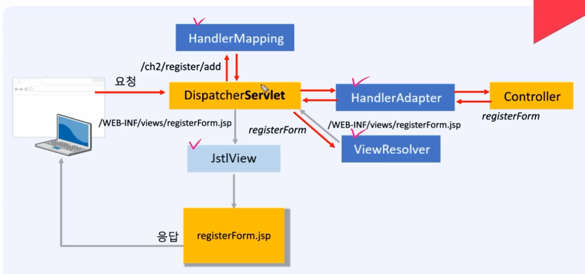

## dispatcherServlet 파헤치기

hadlerMapping : map 형식으로 가지고 있어서 url에 값에 맞는것을 찾아서 메서드를 컨트롤러에서 호출한다

handleradapter (느슨한연결: 변경유리): 핸들러 어댑터에 연결된 것을 다양하게 연결이 될수 있어서  유연하다, 서블릿도 호출 가능

viewResolver : 실제뷰이름을 알려줌

jstlview  (느슨한연결: 변경유리)