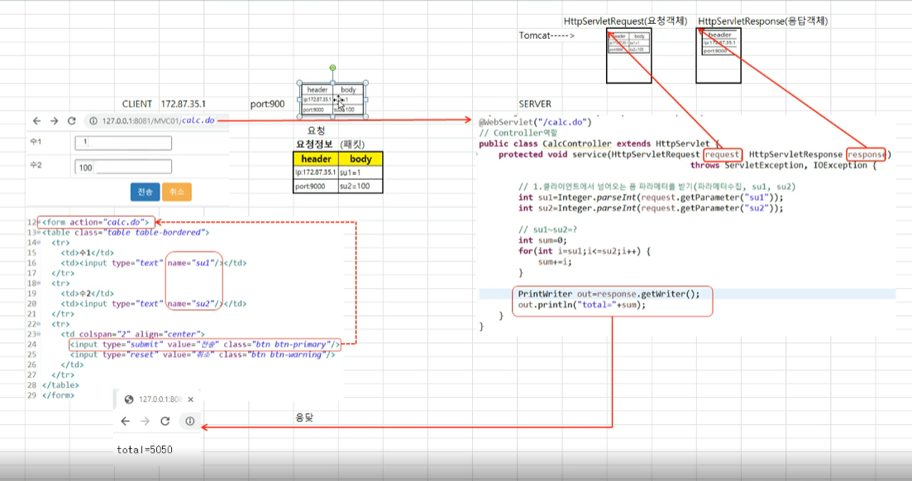
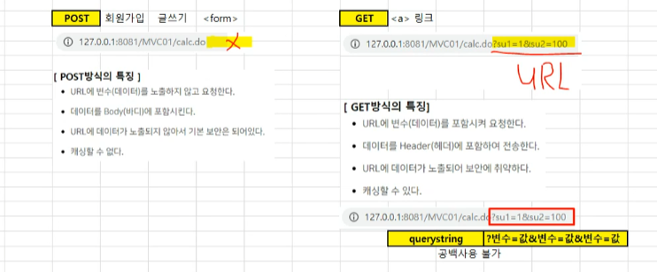
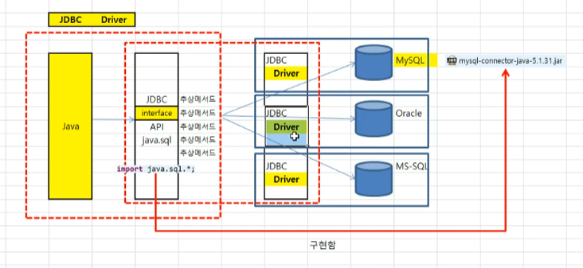
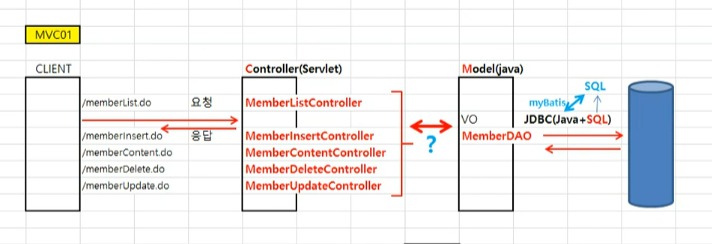

## 요청(httpSerletRequest)과 응답(HttpSerlvetResponse)이해하기

request, response  패킷에 정보들이 저장되어 전달된다

tomcat  서버가 request객체와 response 객체를 만들어서 전달해준다

## post방식과 get 방식

## 한글 처리

~~~java
// 0. 한글인코딩
request.setCharacterEncoding("utf-8");
~~~

## jdbc

각 드라이버로 인터페이스를 구현을 해서 서로 다른 db언어에서도 구현이 가능하다 

## mvc01 구조

요청건에 대해 모든 컨트럴러가 있다 

### 리다이렉트

~~~java
response.sendRedirect("/MVC01/memberList.do");
~~~

