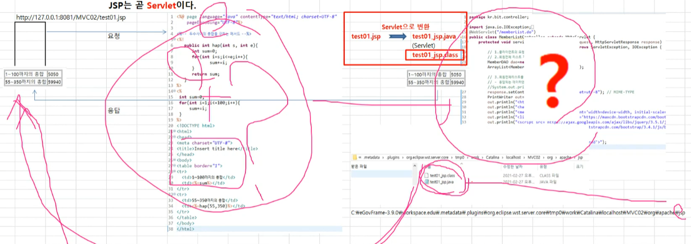
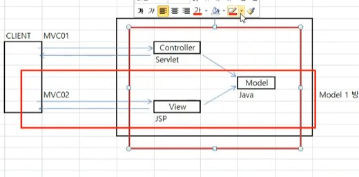

## JSP

~~~java
//스크립트적인 요소
<%@page %> - page지시자
<%@include %> - include지시자
<%@taglig %> - taglib지시자
    
//스크립트릿
<%      %> 
//출력식
<%=     %>
//선언문
<%!     %>
//jsp주석
<%--   --%>
~~~

**jsp 변환 (서블릿)**

jsp페이지가 서블릿으로 변환이 되어 클래스 파일이 되고  html파일을 클라이언트 보낸다 

## model 1방식

mvc02 

jsp- model이 모델 1방식