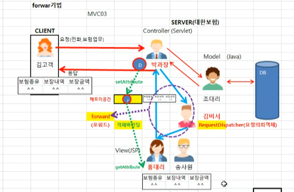
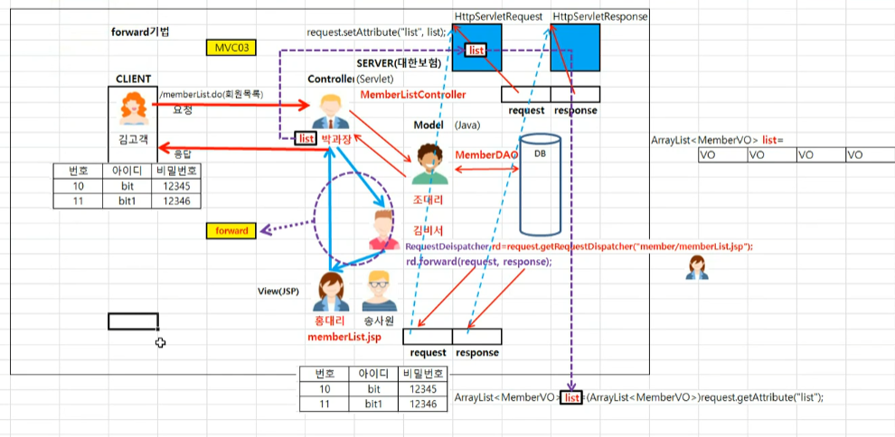
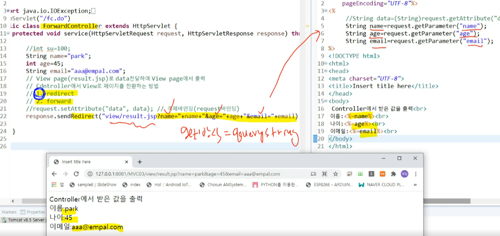
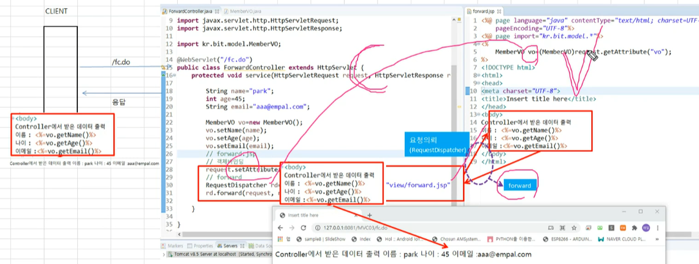
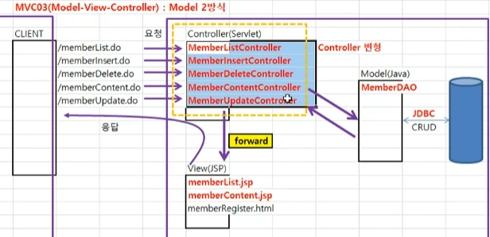

## forwad 기법

공용으로 쓸수있는 메모리를공간에 값을 넣고 뺄수 있게 한다

※ **객체 바인딩** 

setAttribute : 값을 넣고 

getAttribute: 값을 뺀다

jsp에서 언제든지 메모리 공간에서 값 가져올수 있다

~~~java
//객체바인딩
request.setAttribute("list",list);
~~~

포워드

~~~java
//요청을 의뢰할 페이지를 얻어옴
RequestDeispatcher rd = request.getRequestDispatcher("member/memberList.jsp");
//jsp에 포워드를 통해서 값을 넘겨준다
rd.forward(request,response);
~~~

1. 컨트롤러가 객체바인딩을 한다
2. RequestDeispatcher를 이용해서 포워딩을한다

##  데이터 전달방법

### 1. redirect

파라미터로 연결

### 2. forward

## model2 방식

## jstl

프로그래밍과 디자인 개발하는데 있어서 불편점이 있어서 태그 방식으로 정함

JSTL 사용방법

1. jstl.jar 다운받아서 추가하기
2. 태그 추가

~~~java
<%@taglib prefix="c" uri="http://java.sun.com/jsp/jstl/core"%>
~~~

### jstl tag

~~~java
<c:set var="cnt" value="7">
<c:if test="${cnt%2==0}">
    
</c:if>
~~~

