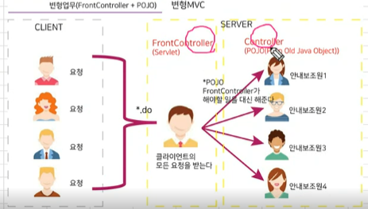
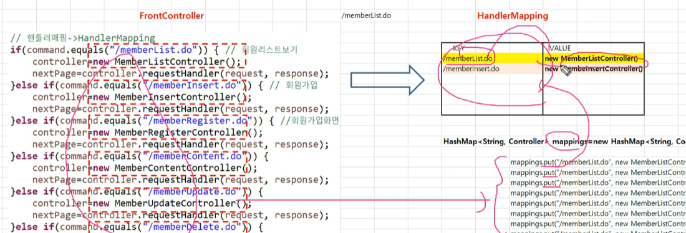

## frontController

frontController에서 모든 요청을 받아서 pojo형태로 일을 분배한다

frontController: serlvet

controller: java

## POJO 하는일

~~~java
//POJO가 해야할 일의 범위
//1. model 연동
MemberDAO dao=new MemberDAO();
List<MemberVO> list=dao.memberList();
// 2. 객체바인딩
request.setAttribute("list", list);
// member/memberList.jsp
// 다음페이지는 
// 3.다음페이지정보(View)
return "memberList";		
~~~

## HandlerMapping

키값에 맞는 것을 찾아서 value 값을 가져온다

## ViewResolver

뷰의 이름만 리턴할수 있도록 하는것

~~~java
//앞뒤로 값을 매핑해주어서 페이지이름만 쓰고 사용할수 있개헌더 
return "/WEB-INF/member/"+nextPage+".jsp";
~~~

