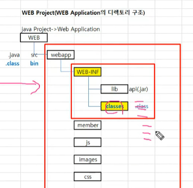
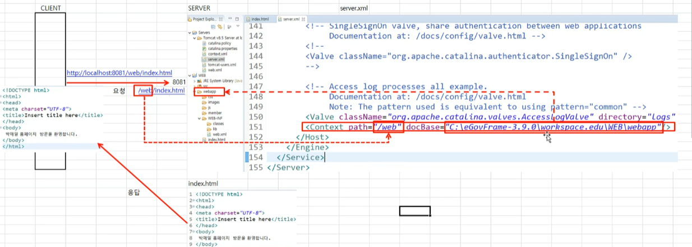
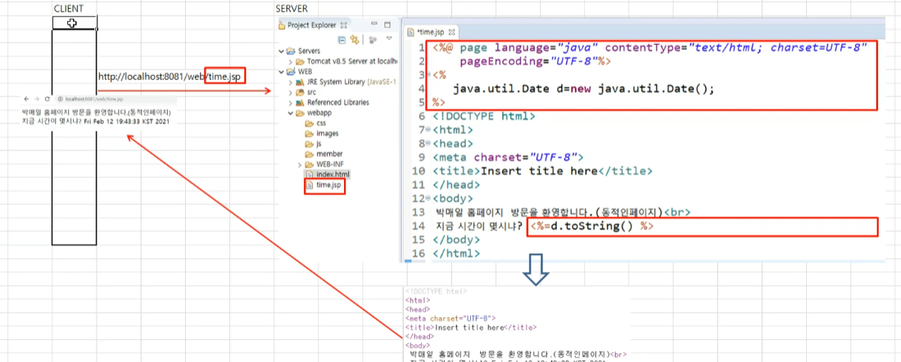
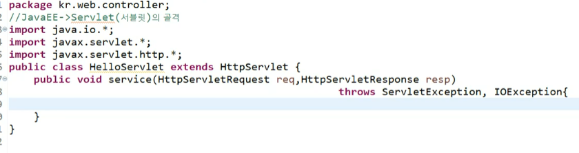

# web Application  구조

 

비유

webapp : 아파트 

web-INF : 경비실

classes: 경비실 중요한정보

server.xml :  tomcat 서버에 webapp을 등록해주어야 서버에 올려서 사용할수 있다

## JSP만들고 구동하기

1. lib폴더에 jar 파일을 옮기기
2. 속성 : java build path에 jar 추가하기

### jsp 구현

### 서블릿

서블릿 기본 규격

클래스파일이며  httpServlet 상속을 받아서  service 재정의해서 값을 요청하고 받아올수 있다. 각 port, url 정보가 포함되어 있다

### 서블릿  실행

서블릿 web.xml에 등록을 해서 서블릿을 실행할수있도록한다

~~~java
@WebSerlet("/hs.do");
~~~

서블릿파일에 추가해주어서 web.xml에 추가를 안해주어도 된다 

### dynamic web project

수동으로 위에서 만든것을 웹프로젝트 형식을 자동으로 만들어 준다

