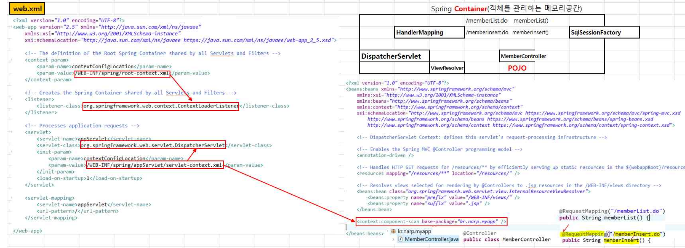

## MAVEN

프로젝트 관리 도구

## 스프링 

handlerMapping, FrontController, ViewResolver를 자동으로 제공해준다 

---

### pom.xml

라이브러리 관리

depndency 파일을 삭제하면 라이브러리에 jar파일이 같이 삭제가 된다

필요한 api가 있으면 api 저장소 사이트에서 maven 전용으로 나온 코드를 복사해서 

붙여넣어주면 자동으로 다운로드해주어서 설정해준다

---

## Spring Container

: 객체를 관리하는 메모리 공간

DI 의존성주입을 할때 미리 객체를 생성하는 공간을 컨테이너로 한다

frontController가 spring에서  dispatcheServlet이다

---

1. dispatcherSerlvet으로 .do로 파일이 들어오면 halderMapping에서 맞는 메서드를 찾아서 MemberController에서 찾는다 
2. 컨트롤러에서 dao는 이미 스프링 컨테이너에서 객체를 생성하였으므로 @Autowired로 해서 객체를 가져와서 사용한다 
3. mybatis에서 sqlSessionFactory를 사용할때도 미리 컨테이너에 선언이 되어있어서 위와 마찬가지로 @Autowired로 해서 가져온다
4. 리턴이 될때 viewResolver에서 경로를 지정해주어서 jsp로 넘어가고 응답을 해준다

~~~java
//이렇게 해주면 스프링 컨테이너에 있는것을 자동으로 가져오겠다는 것이다
@Autowired
private MemberDAO dao
~~~

---

## 파라미터 수집 (VO)

파라미터로 vo값을 받아오면 바로 사용을 할수 있다 

