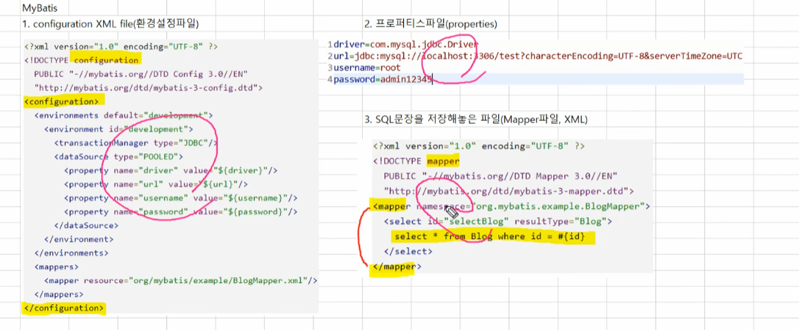
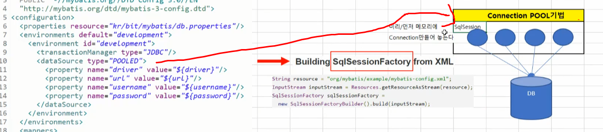
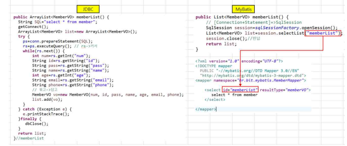

## myBatis

### jdbc 단점

1. 데이터베이스 접속정보가 노출
2. java코드와 sql 코드가 하나로 통합되어 있다
3. 개발자가 모든것을 해야하므로 개발속도가 느리다

※ ibatis 

: mybatis이전 버전

## myBatis 설정

3개의 파일이 있어야 접속을 할수 있다

- configuration.xml 파일에서 properties 파일과 mapper파일을 등록을 해준다 

## Connection POOL 기법

: 미리 먼저 메모리에  Connection 만들어 놓은 공간을 connection pool이라고 한다

- 만약 자바에서 db작업을 하고 싶을때 커넥션 풀에서 객체 하나 가져와서 db작업을 하고 객체를 반납한다

- jdbc는 접속하고 끊고 반복하기 때문에 부하가 발생하는데 mybatis는 connection pool기법을 사용하기 때문에 성능이 더 좋다

- 커넥션 풀에 하나하나 객체들을 sqlSession이라고 불리고 sqlSession이 여러개 모아져 있는 공간을 sqlSessionFactory객체라고 불린다

## 비교

