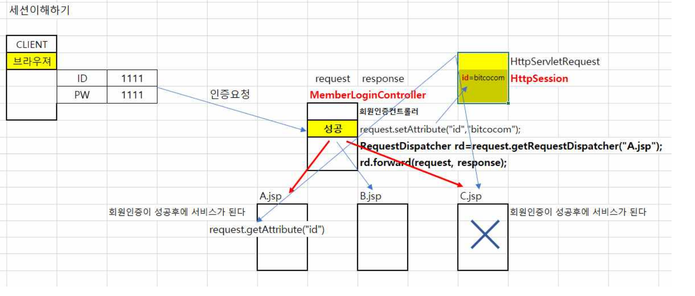
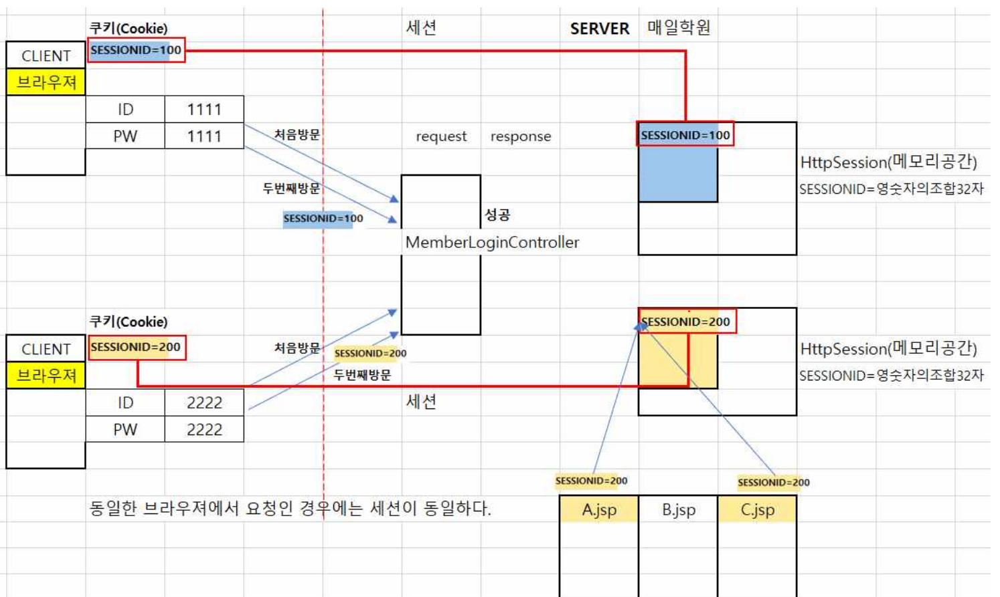
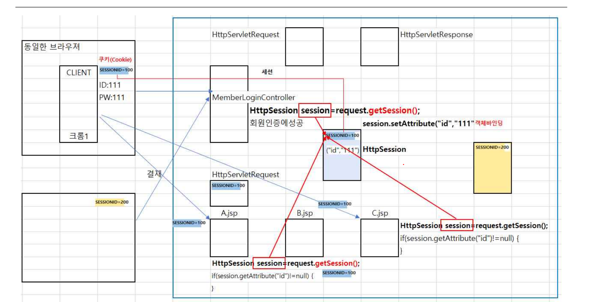

## 세션

### request 바인딩 한계

한개의 페이지만 처리가 가능하다

## 세션이란 

1. 처음 방문때 서버에 httpSession 메모리 공간에 세션id값을 만들어지고 그 id를 브라우저에 쿠키에 보내준다 
2. 두번째 방문시 요청값을 확인해서 세션 id를 확인해서 일치하는게 있는지 확인한다

request.getSession 세션값 가져오기

