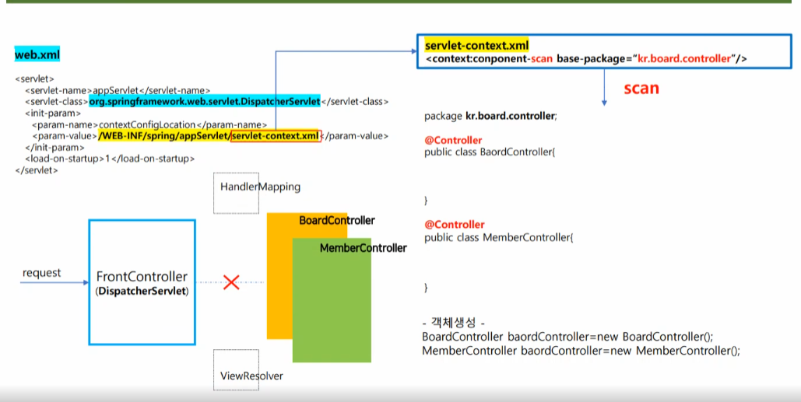
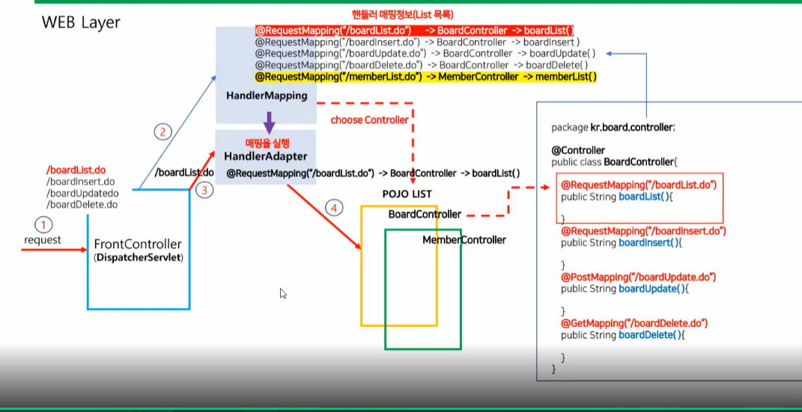
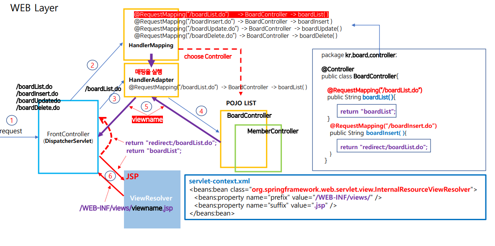
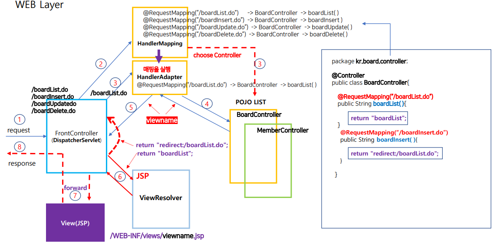
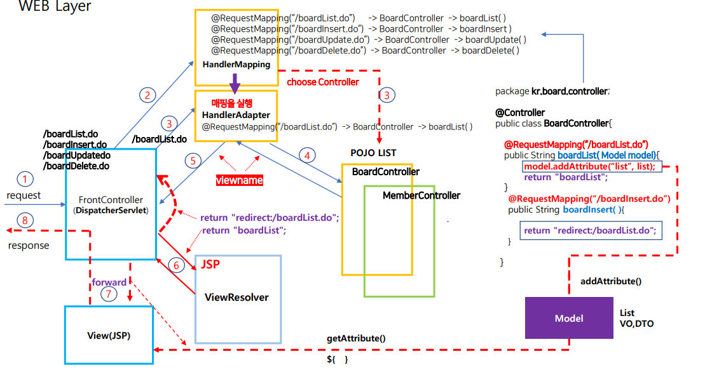
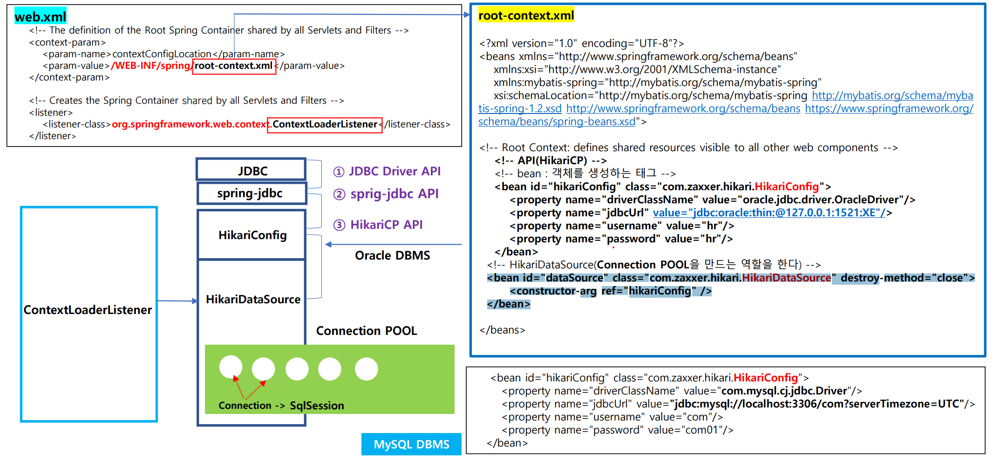

### FrontController(DispatcherSerlvet) + Controller(POJO)

- frontController는 스프링에서 dispatcherSerlvet이다

1. web.xml에서 dispatcherSerlvet 메모리에 만들어진다
2. servlet-contetn.xml읽어 컴포넌트 스캔을 해서 @Controller가 있는 것을 모두 찾아 객체 생성을 해준다

### HandlerMapping, HandlerAdater Loading(@RequestMapping, @GetMapping, @PostMapping)

1. HadlerMapping에서 컨트롤러를 스캔해서 핸들러 매핑정보를 만들어둔다
2. 만약 /boardList.do 를 호출하면 HanlderAdatper에서 그것에 맞는 메서드를 찾아서 실행을 해준다

### ViewReslover

1. 리턴되는값을 핸들러어댑터를 거쳐서 Front컨트롤러로로 오는데 만약 리다이렉트는 되는것은 재호출을 하고 아닌것을 뷰리졸브에서 조합된 경로로 이동하게 된다

### foward

1. frontController에서 jsp쪽으로 foward을 해서 보낸고 결과를 다시 frontcontroller에게 보여주어서 응답을 한다

### 객체바인딩

1. 컨트롤러에서 뷰에 데이터를 보내기 위해 모델에 값을 추가(addAttribute) 해주고 뷰단에서 getAttribute를 해서 값을 가져와서 화면을 구성한다

## Persisten Layer

### connection pool 만들기

1. contextLoaderListener객체를 만들고 root-context.xml에서 hikariconfig api를 사용해서 각 커넥션 풀 만들기ㅣ에 필요한 정보를 정의를 해둔다

